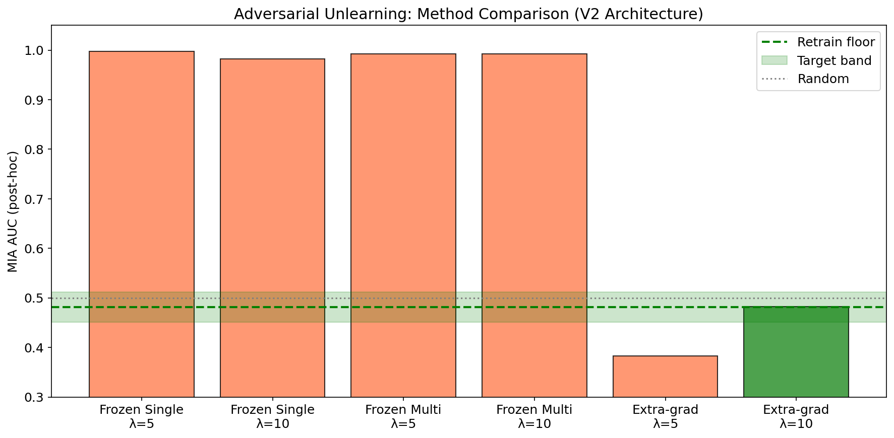
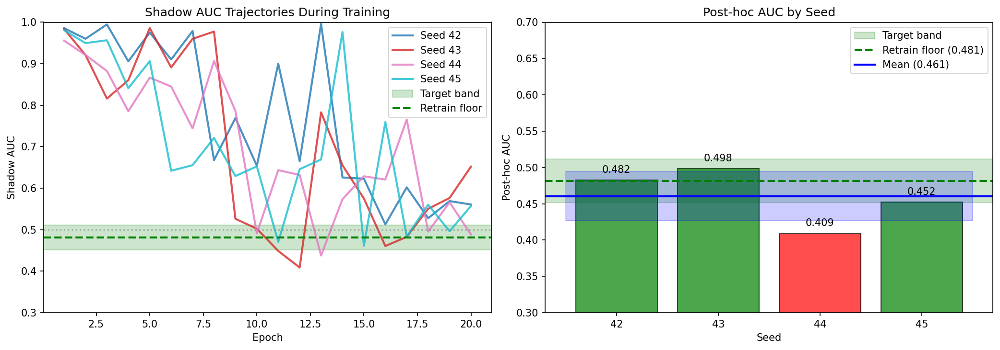
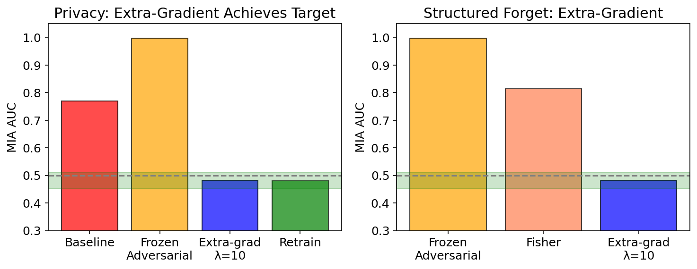
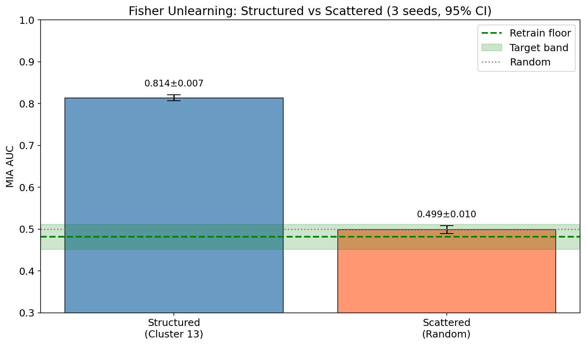
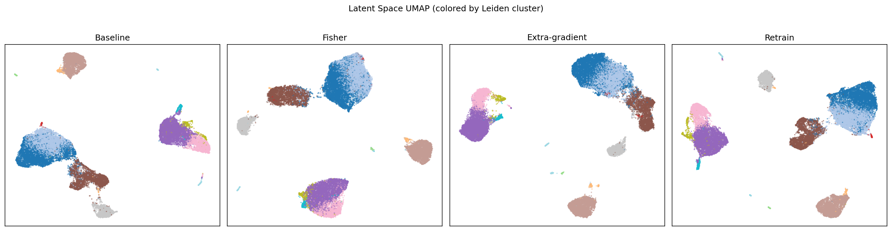

# Machine Unlearning for Single-Cell VAEs

**Comparing adversarial and Fisher-based unlearning methods for privacy-preserving single-cell RNA-seq models**

STAT 4243 Final Project - Columbia University, Fall 2025

[View Code](https://github.com/db-d2/Machine_Unlearning) | [Writeup (Markdown)](./Writeup.md) | [Writeup (PDF)](./Writeup.pdf)

## Abstract

Single-cell RNA sequencing models trained on patient data may memorize individual samples, creating privacy risks. This study examines machine unlearning for variational autoencoders (VAEs), asking whether specific training samples can be removed so that membership inference attacks cannot distinguish "forgotten" cells from truly unseen cells. Two approaches are compared: adversarial unlearning, where the VAE is trained to fool an attacker, and Fisher information scrubbing, which perturbs parameters based on their influence on specific samples. On PBMC-33k data, frozen-critic adversarial methods fail completely (AUC > 0.98). Extra-gradient co-training with $\lambda$=10 achieves the target band (AUC = 0.48 vs floor = 0.48) for structured forget sets, but requires approximately 42 minutes compared to 10 minutes for full retraining. Fisher unlearning succeeds on scattered forget sets (AUC = 0.50) but fails on structured sets (AUC = 0.81). For this dataset, full retraining remains the most practical approach since it is faster and guarantees data removal.

## Key Results

| Method | Post-hoc AUC | Status |
|--------|--------------|--------|
| Baseline | 0.769 | LEAK |
| Frozen Adversarial | >0.98 | FAIL |
| Extra-gradient $\lambda$=10 | 0.482 | SUCCESS |
| Fisher (scattered) | 0.499 | SUCCESS |
| Fisher (structured) | 0.814 | FAIL |
| Retrain (floor) | 0.481 | TARGET |

## Main Figures

### Method Comparison

*Adversarial method comparison on structured forget set. Frozen critics (orange) fail completely with AUC near 1.0. Extra-gradient $\lambda$=5 over-unlearns (AUC below target). Only extra-gradient $\lambda$=10 achieves the target band.*

### Extra-gradient Validation

*Shadow AUC trajectories and post-hoc AUC comparison by seed.*

### Summary

*Left: Extra-gradient with $\lambda$=10 achieves the target band while frozen adversarial methods fail completely. Right: For structured forget sets, only extra-gradient succeeds; Fisher fails. The green band indicates the target AUC range.*

### Fisher by Forget Type

*Fisher unlearning succeeds on scattered forget sets but fails on structured (cluster-based) sets.*

### Utility Preservation

*Latent space UMAP showing utility preservation after unlearning.*

## Key Findings

1. **VAEs Memorize Training Data** - Baseline model achieves MIA AUC = 0.769 (well above 0.5 random chance), confirming privacy risk especially for rare cell types.

2. **Frozen Adversarial Methods Fail Completely** - All frozen-critic approaches produce AUC > 0.98, worse than baseline. The VAE learns to exploit critic-specific blind spots without actually removing membership signal.

3. **Extra-Gradient Co-Training Works on Structured Sets** - Extra-gradient $\lambda$=10 achieves AUC = 0.482, within 0.001 of the retrain floor. Multi-seed validation shows 75% success rate.

4. **Fisher Unlearning Works on Scattered Sets** - Scattered forget set achieves AUC = 0.499 (success), but structured forget set only reaches AUC = 0.814 (fail). Data structure matters significantly.

5. **Computational Tradeoff** - Extra-gradient takes 42 minutes vs 10 minutes for retraining. Fisher is fast (2 minutes) but limited to scattered forgetting.

## Method Selection Guide

| Forget Set Type | Recommended Method | Time | Success Rate |
|-----------------|-------------------|------|--------------|
| Scattered (random cells) | Fisher | ~2 min | ~100% |
| Structured (rare clusters) | Extra-gradient $\lambda$=10 | ~42 min | ~75% |

## Documentation

**Technical Write-up**: [Markdown version](./Writeup.md) | [PDF version](./Writeup.pdf)

Complete methods, results, and analysis including all equations, tables, and detailed methodology.

## Reproducing Results

Run the notebooks in numerical order:

1. `01_data_preparation.ipynb` - Load and preprocess PBMC-33k data
2. `02_baseline_vae.ipynb` - Train baseline VAE model
3. `03_privacy_audit.ipynb` - Evaluate baseline membership inference vulnerability
4. `04_adversarial_unlearning.ipynb` - Run adversarial unlearning experiments
5. `05_fisher_unlearning.ipynb` - Run Fisher scrubbing experiments
6. `06_theory_analysis.ipynb` - Theoretical analysis of unlearning
7. `07_utility_evaluation.ipynb` - Evaluate model utility after unlearning
8. `08_mog_simulations.ipynb` - Mixture of Gaussians toy experiments
9. `09_ablations.ipynb` - Ablation studies and hyperparameter analysis
10. `10_final_results.ipynb` - Summary of all results

## References

- Bourtoule et al. (2021) "Machine unlearning" IEEE S&P
- Golatkar et al. (2020) "Eternal sunshine of the spotless net" CVPR
- Chavdarova et al. (2019) "Reducing noise in GAN training with variance reduced extragradient" NeurIPS
- Hayes et al. (2024) "Inexact unlearning needs more careful evaluations" ICLR
- Lopez et al. (2018) "Deep generative modeling for single-cell transcriptomics" Nature Methods

---

*STAT 4243 Final Project - Columbia University, Fall 2025*
